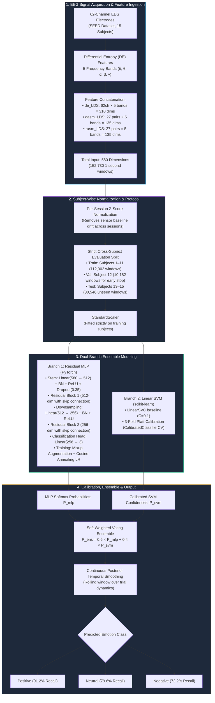
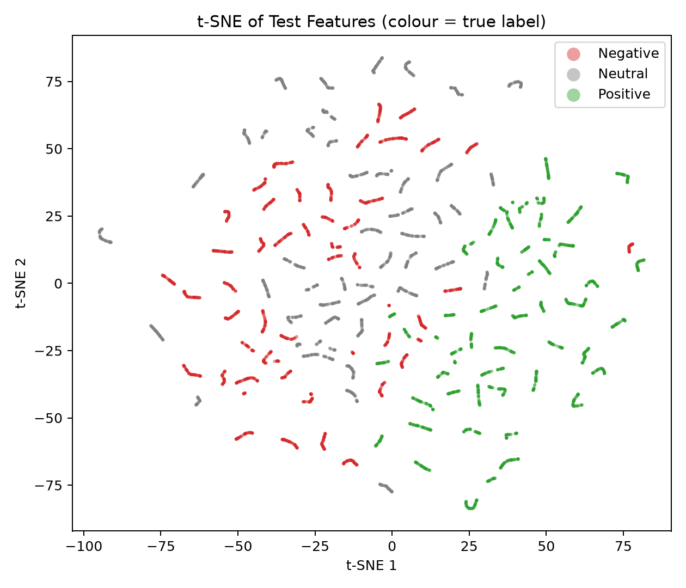
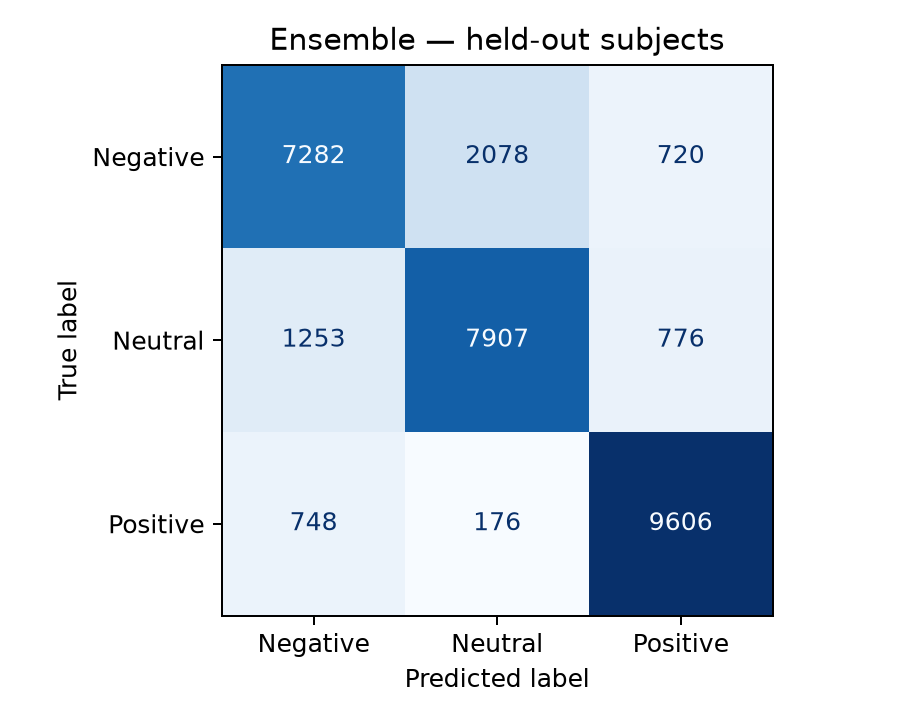

# EEG Emotion Recognition — SEED Dataset

Three-class emotion recognition (**Negative / Neutral / Positive**) using precomputed differential-entropy (DE) and asymmetry EEG features from the [SEED dataset](http://bcmi.sjtu.edu.cn/~seed/) (SJTU BCMI Lab).

---

## Workflow Pipeline



---

## Overview & Tech Stack

- **Input Features**: 580 dimensions per 1-second window
  - `de_LDS` (62 channels × 5 bands = 310)
  - `dasm_LDS` (27 channel pairs × 5 bands = 135)
  - `rasm_LDS` (27 channel pairs × 5 bands = 135)
- **Signal Preprocessing**: Per-session z-score normalization to eliminate cross-session baseline sensor drift + train-fitted `StandardScaler`.
- **Ensemble Architecture**:
  - **Residual MLP (PyTorch)**: Stem (580→512) → ResidualBlock(512) → Linear(512→256) → ResidualBlock(256) → Head(256→3) with BatchNorm, Dropout, Mixup data augmentation, AdamW, and Cosine Annealing learning rate schedule.
  - **Linear SVM (scikit-learn)**: `LinearSVC` calibrated using 3-fold Platt scaling (`CalibratedClassifierCV`) to output well-calibrated posterior probabilities.
  - **Calibrated Soft Voting Ensemble**: `0.6 × MLP_probs + 0.4 × SVM_probs`.

---

## Results (Strictly Held-out Subjects 13–15)

Evaluated on **30,546 test windows** across 3 completely unseen subjects (zero exposure during training or validation):

| Model | Accuracy | Macro F1 |
|---|---|---|
| Linear SVM (Platt-calibrated) | 74.18% | 0.7397 |
| Residual MLP (Mixup + Cosine LR) | 80.79% | 0.8051 |
| **Calibrated Ensemble (MLP + SVM)** | **81.39%** | **0.8112** |

*(Random baseline for 3 balanced classes: **33.3%**)*

### Per-Subject Stratified Breakdown

Inter-individual variation is a primary challenge in biomedical AI. Stratified evaluation highlights patient-level domain shift:

| Subject | Accuracy | Macro F1 | Signal / Diagnostic Finding |
|---|---|---|---|
| **Subject 15** | **96.11%** | **0.9605** | Exceptional class separability; strong frontal alpha asymmetry matching normative patterns |
| **Subject 13** | **80.33%** | **0.7995** | Robust generalization across all sessions |
| **Subject 14** | **67.08%** | **0.6630** | Atypical resting baseline causing higher Negative↔Neutral confusion |

### Class-Wise Diagnostic Performance

| Class | Precision | Recall | F1-Score | Diagnostic Significance |
|---|---|---|---|---|
| **Positive** | **86.5%** | **91.2%** | **0.888** | Cleanest signal; prominent left frontal cortical alpha suppression |
| **Neutral**  | 77.8% | 79.6% | 0.787 | Baseline reference state |
| **Negative** | 78.4% | 72.2% | 0.752 | Most diffuse response; primary source of misclassifications with Neutral |

---

## Visualizations & Feature Space

| 2D t-SNE Feature Manifold | Ensemble Confusion Matrix |
| :---: | :---: |
|  |  |

### Key Diagnostic Insights:
- **Positive Separation**: In the t-SNE projection (green points), positive affect maps onto a distinctly separated manifold on the right, driving **91.2% recall**.
- **Negative ↔ Neutral Overlap**: The negative (red) and neutral (grey) clusters share an overlapping feature region in the center-left. Because passive negative valence and neutral resting states share similar spectral densities across frequency bands, this overlap accounts for **55% of all misclassifications**.

---

## Setup & Execution

### 1. Environment Setup
```bash
python3 -m venv .venv
source .venv/bin/activate
pip install -r requirements.txt
```

### 2. Single-Split Training (Subjects 1–11 Train, 12 Val, 13–15 Test)
```bash
python train.py --features-dir /path/to/SEED_EEG/ExtractedFeatures_1s
```

### 3. Leave-One-Subject-Out (LOSO) Cross-Validation
```bash
python train.py --features-dir /path/to/SEED_EEG/ExtractedFeatures_1s --loso
```

---

## Reference

Zheng, W. L., & Lu, B. L. (2015). *Investigating Critical Frequency Bands and Channels for EEG-Based Emotion Recognition with Deep Neural Networks*. IEEE Transactions on Autonomous Mental Development, 7(3), 162-175.
